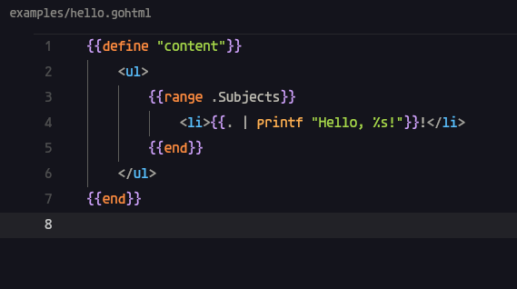
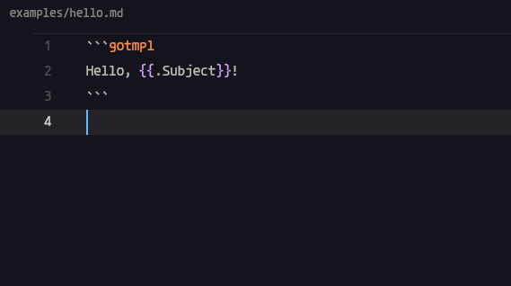
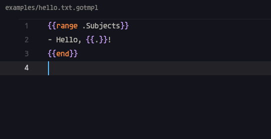

# Zed Extension for Go Templates

A Zed extension providing rudimentary (includes syntax highlighting) support for Go templates (`text/template` and `html/template`).

## Syntax Highlighting

This extension provides comprehensive syntax highlighting for Go templates, including:

- **Keywords**: `define`, `block`, `if`, `else`, `end`, `range`, `template`, `with`
- **Variables**: identifiers and field access (`.Name`, `.User.Email`)
- **Function calls**: `printf`, `len`, `index`, etc.
- **Operators**: `:=`
- **Literals**: strings (interpreted and raw), numbers, booleans, runes
- **Special punctuation**: `{{`, `}}`, `{{-`, `-}}`
- **Comments**: `{{/* ... */}}`
- **Built-in constants**: `nil`, `true`, `false`

For a comprehensive example showcasing all syntax highlighting features, see:

- [`examples/highlights-demo.gotmpl`](examples/highlights-demo.gotmpl) - concise demonstration
- [`examples/comprehensive.gotmpl`](examples/comprehensive.gotmpl) - detailed showcase

## Installation

Clone the repository and [install as a "dev" extension](https://zed.dev/docs/extensions/developing-extensions#developing-an-extension-locally).

## Contributions

For bug reports or feature requests, please open an issue on the GitHub repository.

## Credits

- [ArcherHume/jinja2-support](https://github.com/ArcherHume/jinja2-support) for Zed extension development clues.
- [ngalaiko/tree-sitter-go-template](https://github.com/ngalaiko/tree-sitter-go-template) for the necessary Tree-sitter grammar.

## To-dos

- [ ] Add language server support
